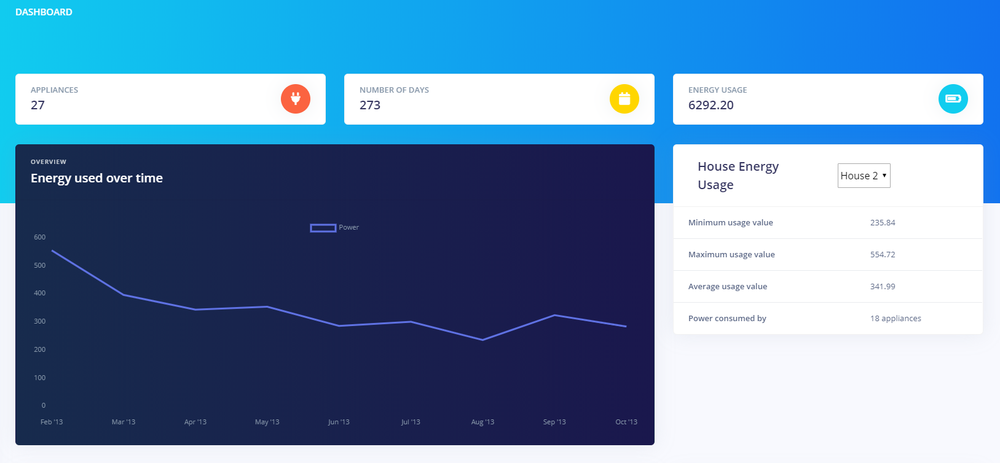
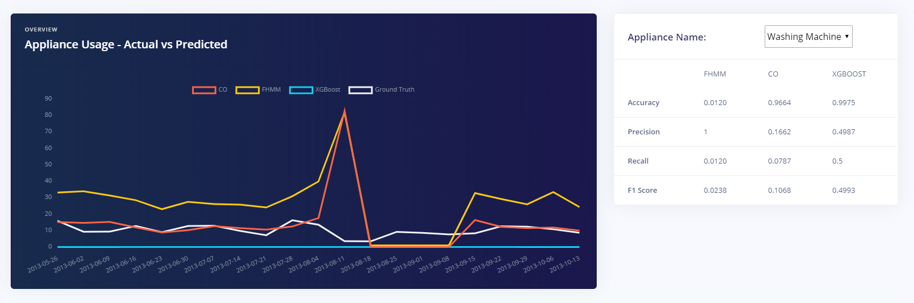
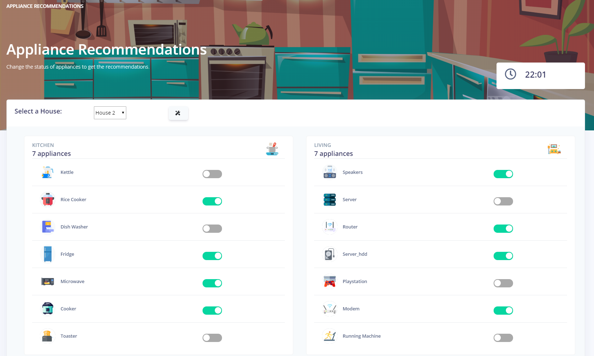
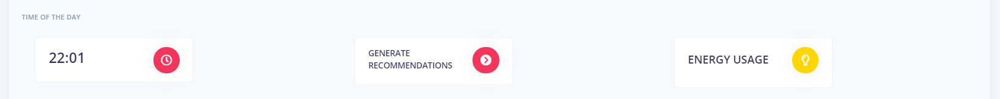
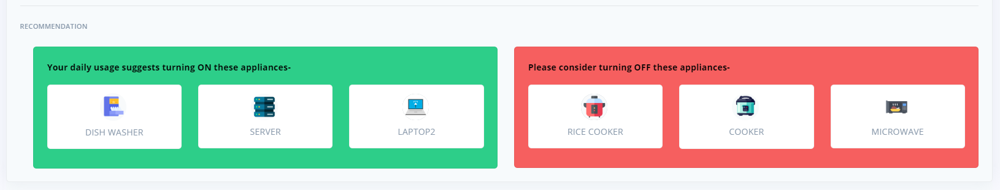
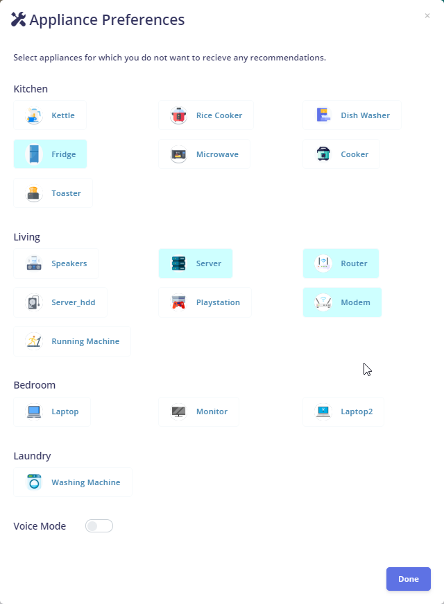
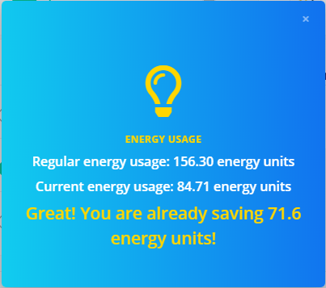

# Real Time Recommendations

The web app serves the purpose to provide ease of access to all the information of the appliances and view the generated recommendations. The Dashboard page let's user get an idea about the energy consumption of the appliances in the house using various visualizations. Also, we have created a simulated environment wherein the user can manually switch ON/OFF an appliance and get the recommendations for the individual appliances.

## The app has two main pages:

- [Dash Board](#dash-board)
- [Application Recommendations](#application-recommendations)

## Dash Board

You can see the number of appliances in the house, the number of days the appliance data is collected over and the total energy usage over a period of time in the page header.

there are two visualizations to analyze the usage of total energy consumed. This will help you to understand the amount of energy actually consumed with respect to each appliance.

The first visualization depicts the energy used over time on the house-level. In this graph, the aggregate power consumed over each month is visualized. Also, various metrics like the minimum/maximum consumption value, average usage value, and the total number of appliances are shown alongwith for the ease of access.
The user can change the house and the metrics will change accordingly.

The next visualization shows the weekly power usage value for individual appliance. This will help in understanding the amount of power consumed by a specific appliance over a period of time. Here, you can select individual appliance and check it's power consumption values. Comparision between the predicted power values obtained using three different techniques: The ground truth, Factorial Hidden Markov Model, and Combinatorial Optimization algorithms is provided alongwith.

Moreover, you can analyze the performance metrics on the basis of accuracy, precision, recall, and the F1 score for these algorithms.

## Application Recommendations

- This page presents a simulation of our system and illustrates how the recommendations work.
- A house can be select from the house drop down, for which you want to view the simulation.
- The following section represents different rooms in the house with various appliances, with each appliance given a switch to be turned on or off as required.

- Following section lets select a time of the day for which you want the recommendations. Here, the system time is selected by default. However, you can select any time of the day for which you want the recommendations.

- Clicking the Generate Recommendations button gives you the following recommendations
  - Recommendations for appliances which are currently OFF, but can be swithced on, based on the daily usage pattern, are shown in the green card.
  - Similarly, appliances which are ON, but should be swithced OFF are displayed in the RED card.

### Additional Features

The web app provides following additional features-

#### Appliance Preferences

- The features lets you select appliances for which you do not want to receive any recommendations for.

#### Energy Usage Statistics

- Here you can view the energy regularly used at the current time instance, according to the usage pattern.
- Similarly, the current energy usage according to current state of appliances is also shown.
- On the basis of recommendations provided, you can also see the whether you can save more energy using those recommendations or if you are already saving some.

#### Voice Mode

- You can activate/deactivate voice mode from the preferences tab.
- If activated, you can switch on/off any appliances using voice commannds and get voice recommendations.

